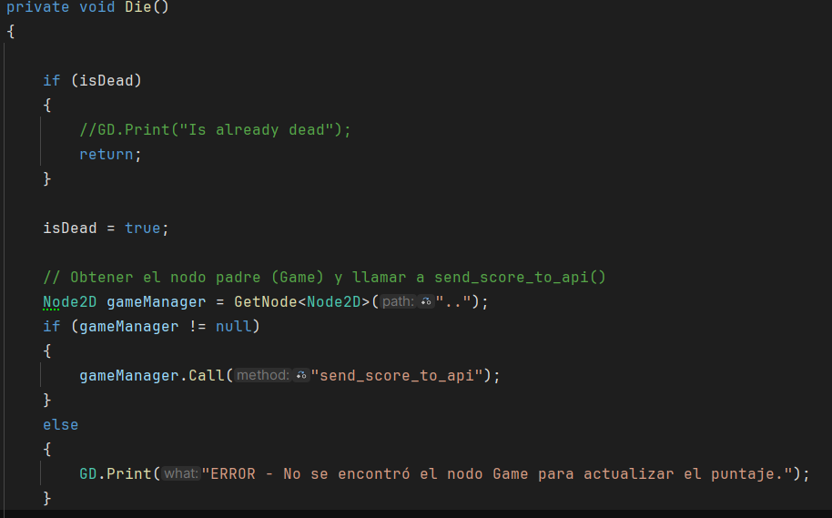

## Unión con la API en Render
Principalmente he cambiado y creado la implementación de la API conn Godot dentro de [**gameScript**](scripts/gameScript.gd).

Dentro de [**Player**](scripts/Player.cs) he implementado también la llamada a la API cuando muere:

La funcionalidad principal es:
- Comprobar con una llamada a la API de **GetAll** si hay algun jugador creado
- Si lo hay, usa el primero para jugar. Si no lo hay, lo crea con un **Post**
- Luego obtiene con un **Get** su ultima punntuación para mostrarla por pantalla
- Cuando se recogen todas las monedas o cuando muere, se llama a la API para guardar los cambios de la puntuación.
